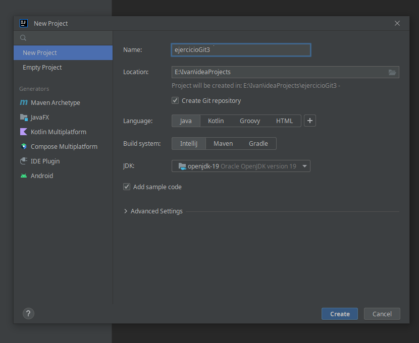
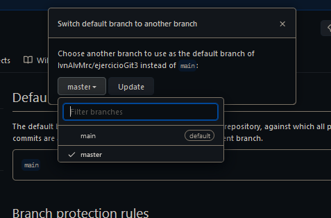
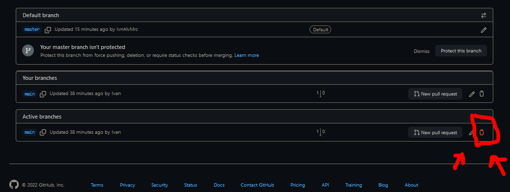

# ejercicioGit3

 ### 1º- Creo el repositorio en github marcando las opciones de README y _.gitignore_ .

### 2º- Creación del proyecto en IntelliJ


```bash
a17ivanam@W10N-I9E20 MINGW64 /e/Ivan/ideaProjects/ejercicioGit3 (master)
$ git status
On branch master

No commits yet

Changes to be committed:
  (use "git rm --cached <file>..." to unstage)
        new file:   .gitignore
        new file:   .idea/misc.xml
        new file:   .idea/modules.xml
        new file:   .idea/vcs.xml
        new file:   .idea/workspace.xml
        new file:   ejercicioGit3.iml
        new file:   src/Main.java
```
### 3º- Añado el repositorio de GitHub como remoto e intento hacer un pull.
```bash
a17ivanam@W10N-I9E20 MINGW64 /e/Ivan/ideaProjects/ejercicioGit3 (master)
$ git remote add origin https://github.com/IvnAlvMrc/ejercicioGit3

a17ivanam@W10N-I9E20 MINGW64 /e/Ivan/ideaProjects/ejercicioGit3 (master)
$ git pull origin main
remote: Enumerating objects: 3, done.
remote: Counting objects: 100% (3/3), done.
remote: Total 3 (delta 0), reused 0 (delta 0), pack-reused 0
Unpacking objects: 100% (3/3), 596 bytes | 5.00 KiB/s, done.
From https://github.com/IvnAlvMrc/ejercicioGit3
 * branch            main       -> FETCH_HEAD
 * [new branch]      main       -> origin/main
```
No deja hacer el pull por que tengo cambios en local que no a los cuales no he realizado un commit.

### 4º Quito los cambios del stage local. 

```
a17ivanam@W10N-I9E20 MINGW64 /e/Ivan/ideaProjects/ejercicioGit3 (master)
$ git rm --cached -r .
rm '.gitignore'
rm '.idea/misc.xml'
rm '.idea/modules.xml'
rm '.idea/vcs.xml'
rm '.idea/workspace.xml'
rm 'README.md'
rm 'ejercicioGit3.iml'
rm 'src/Main.java'

a17ivanam@W10N-I9E20 MINGW64 /e/Ivan/ideaProjects/ejercicioGit3 (master)
$ git status
On branch master
Changes to be committed:
  (use "git restore --staged <file>..." to unstage)
        deleted:    README.md

Untracked files:
  (use "git add <file>..." to include in what will be committed)
        .gitignore
        .idea/
        README.md
        ejercicioGit3.iml
        img/
        src/
```
### 5º- Ahora ya tengo  descargado todo lo que estaba en remoto en la rama principal a mi rama master local.
Ahora he comiteado el proyecto __local__ y lo subo al repositorio.

```bash
a17ivanam@W10N-I9E20 MINGW64 /e/Ivan/ideaProjects/ejercicioGit3 (master)
$ git add .
warning: in the working copy of '.gitignore', LF will be replaced by CRLF the next time Git touches it
warning: in the working copy of '.idea/workspace.xml', LF will be replaced by CRLF the next time Git touches it
warning: in the working copy of 'src/Main.java', LF will be replaced by CRLF the next time Git touches it

a17ivanam@W10N-I9E20 MINGW64 /e/Ivan/ideaProjects/ejercicioGit3 (master)
$ git commit -m "Primer commit en local"
[master d3d3529] Primer commit en local
 8 files changed, 117 insertions(+)
 create mode 100644 .gitignore
 create mode 100644 .idea/misc.xml
 create mode 100644 .idea/modules.xml
 create mode 100644 .idea/vcs.xml
 create mode 100644 .idea/workspace.xml
 create mode 100644 ejercicioGit3.iml
 create mode 100644 img/1.png
 create mode 100644 src/Main.java

a17ivanam@W10N-I9E20 MINGW64 /e/Ivan/ideaProjects/ejercicioGit3 (master)
$ git log --oneline
d3d3529 (HEAD -> master) Primer commit en local
f21529c (origin/main) Initial commit

a17ivanam@W10N-I9E20 MINGW64 /e/Ivan/ideaProjects/ejercicioGit3 (master)
$ git push -u origin master
Enumerating objects: 14, done.
Counting objects: 100% (14/14), done.
Delta compression using up to 4 threads
Compressing objects: 100% (11/11), done.
Writing objects: 100% (13/13), 24.92 KiB | 12.46 MiB/s, done.
Total 13 (delta 0), reused 0 (delta 0), pack-reused 0
remote:
remote: Create a pull request for 'master' on GitHub by visiting:
remote:      https://github.com/IvnAlvMrc/ejercicioGit3/pull/new/master
remote:
To https://github.com/IvnAlvMrc/ejercicioGit3
 * [new branch]      master -> master
branch 'master' set up to track 'origin/master'.

a17ivanam@W10N-I9E20 MINGW64 /e/Ivan/ideaProjects/ejercicioGit3 (master)
$ git log --oneline
d3d3529 (HEAD -> master, origin/master) Primer commit en local
f21529c (origin/main) Initial commit


```
_Se subió correctamente pero en la rama ___master___ (la cual es en la que estaba trabajando en local) mientras que la rama main se mantiene con su primer commit._ 

Realizo el cambio de la rama _default_ (que ahora es **main** ) a la rama **master**. 




### 6º- Elimino la rama main. 
[_Dandole al icono de la papelera de basura._]



### 7º- Creo una nueva rama para arreglar un _bug_.
```bash
a17ivanam@W10N-I9E20 MINGW64 /e/Ivan/ideaProjects/ejercicioGit3 (master)
$ git checkout -b fixBug1
Switched to a new branch 'fixBug1'

a17ivanam@W10N-I9E20 MINGW64 /e/Ivan/ideaProjects/ejercicioGit3 (fixBug1)
$

```
